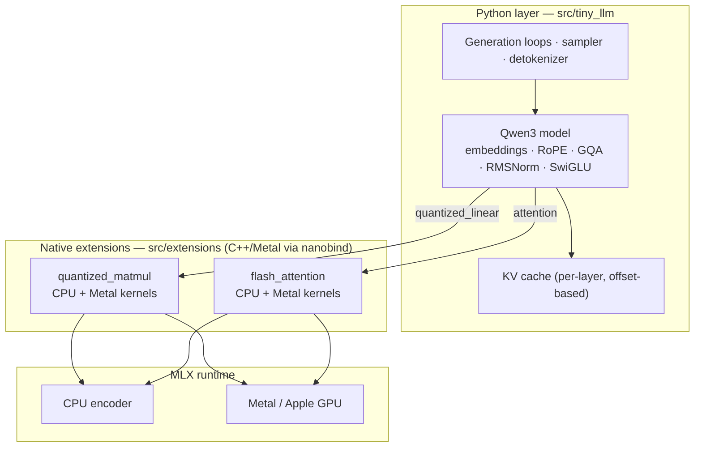
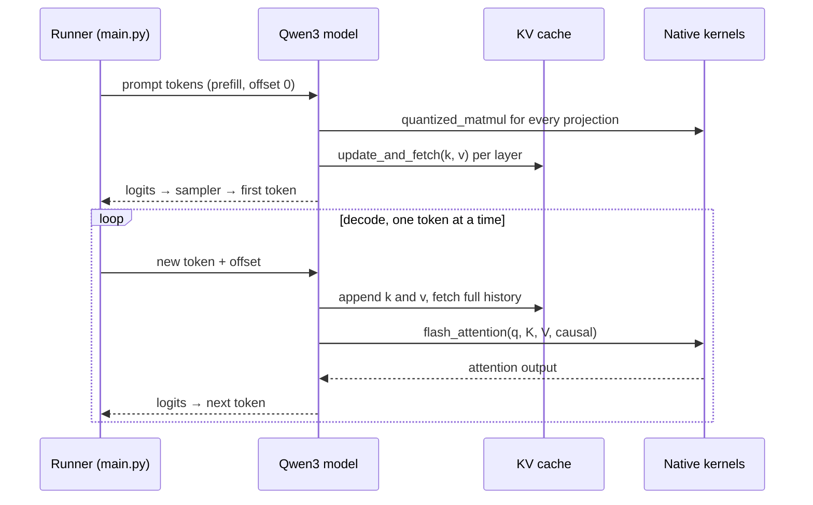

# smol-llm

**LLM inference from first principles: a Qwen3 serving engine written end-to-end on [MLX](https://github.com/ml-explore/mlx), targeting Apple Silicon.**

smol-llm is a transformer inference engine in which nothing is delegated to a framework's model library. Every layer — embeddings, rotary position encoding, grouped-query attention, RMSNorm, SwiGLU — is built directly on raw array operations, and every performance-critical kernel (4-bit quantized matrix multiplication, flash attention) is a custom C++/Metal primitive registered into the MLX runtime. Weights are loaded straight from Hugging Face `MLX-4bit` checkpoints and **remain quantized throughout the forward pass**.

The objective is an engine where every byte of memory traffic and every FLOP is accounted for by code in this repository — and then to push it further: paged KV caches, continuous batching, mixture-of-experts.

## Capabilities

**Model core**

- [x] Qwen3 dense models (0.6B / 1.7B / 4B / 8B) loaded from HF `MLX-4bit` checkpoints
- [x] Full transformer stack from primitives: embedding, RoPE (offset-aware), RMSNorm, SwiGLU MLP, LM head
- [x] Grouped-query attention with causal masking, implemented without high-level attention APIs
- [x] Autoregressive generation with streaming detokenization
- [x] Sampling: temperature, top-*k* (O(n) partition selection), nucleus (top-*p*)

**Memory & attention optimizations**

- [x] KV cache with offset-based decode; the per-token path is logit-parity verified against the reference implementation
- [x] Weights stay in 4-bit group-quantized form — no dense weight materialization
- [x] Custom `quantized_matmul`: C++ CPU kernel and Metal GPU kernel (group size 128, fp16/bf16 scales)
- [x] Flash attention: tiled online-softmax kernels for CPU and Metal, causal and arbitrary masks, GQA-aware
- [ ] bf16 coverage for the attention kernels (currently fp32) and causal fast-path performance hardening

**Serving** — next phase, interfaces reserved

- [ ] Chunked prefill and continuous batching
- [ ] Paged KV cache and paged attention
- [ ] Mixture-of-experts (Qwen3-30B-A3B) and speculative decoding

## Architecture

The engine is three layers. The Python layer owns model structure and scheduling; the native layer owns the two bandwidth-bound kernels; MLX provides unified CPU/GPU execution and lazy evaluation.



### Request data flow

A single-request generation proceeds as prefill followed by per-token decode:



## Design decisions

| Decision | Rationale |
|---|---|
| **Raw array ops, no `nn` modules** | Full control over tensor layout, masking, and intermediate lifetimes. MLX's lazy evaluation and stream model give identical code paths on CPU and GPU, and the cost model stays explicit. |
| **Weights are never dequantized** | Decode is memory-bandwidth bound. The custom matmul dequantizes per group of 128 *inside* the kernel, reading 4-bit packed `uint32` weights — roughly 4× less weight traffic than bf16, with no multi-GB dense copy ever allocated. |
| **Custom MLX primitives instead of Python-side kernel composition** | Each kernel is registered through MLX's C++ extension API with proper stream semantics (CPU encoder path + Metal dispatch). One scheduled primitive instead of many Python-dispatched ops, and no intermediate buffers materialized. |
| **Flash attention with online softmax** | Tiled evaluation (query/key tiles of 32, head dimension 128) with running max/sum rescaling. The `L × S` score matrix is never materialized, keeping attention memory linear in sequence length. |
| **Parity testing as the development method** | Every op is numerically compared against reference implementations across dtype (fp16 / bf16 / fp32) × device (CPU / GPU). Model-level tests compare logits against the upstream MLX model so the engine is validated end-to-end, not just op-by-op. |

## Repository layout

```
src/tiny_llm/     Python engine: model, attention, KV cache, generation, sampling
src/extensions/   C++/Metal kernels + nanobind bindings (tiny_llm_ext)
tests/            Op-level and model-level parity suites
main.py           Single-request runner (model core + KV-cache builds)
batch-main.py     Batched serving runner (serving phase)
bench.py          Throughput benchmark harness (prefill + decode, batched requests)
```

## Roadmap

**Phase 1 — Model core.** Complete. Transformer built from primitives; generation and sampling verified.

**Phase 2 — Memory & attention optimizations.** Functionally complete and parity-tested; hardening in progress (bf16 attention kernels, causal fast-path performance).

**Phase 3 — Serving engine.** The phase currently underway:

1. Chunked prefill and continuous batching (`BatchingKvCache` interface reserved)
2. Paged KV cache with block tables, and a paged attention kernel
3. Mixture-of-experts support for Qwen3-30B-A3B
4. Speculative decoding (draft-model plumbing already present in the runner)

## Known limitations

- Attention kernels are fp32-only today; quantized matmul supports fp16/bf16 activations.
- Model-level logit parity is verified on Qwen3-0.6B; at 4B scale one parity test currently exceeds tolerance and is under investigation.
- Single-request path only; request batching is not implemented yet.
- Benchmarks are measured on the developer's Apple Silicon machine; cross-hardware numbers are not claimed.

## References

- Dao et al., [FlashAttention: Fast and Memory-Efficient Exact Attention with IO-Awareness](https://arxiv.org/abs/2205.14135)
- Ainslie et al., [GQA: Training Generalized Multi-Query Transformer Models from Multi-Head Checkpoints](https://arxiv.org/abs/2305.13245)
- Su et al., [RoFormer: Enhanced Transformer with Rotary Position Embedding](https://arxiv.org/abs/2104.09864)
- [Qwen3 Technical Report](https://arxiv.org/abs/2505.09388)
- [MLX documentation](https://ml-explore.github.io/mlx/build/html/index.html) and the [MLX custom C++/Metal extension example](https://github.com/ml-explore/mlx-examples/tree/main/extensions)
- Yang et al., [Speculative Decoding](https://arxiv.org/abs/2211.17192)

## License

Apache 2.0 — see [LICENSE](LICENSE).
